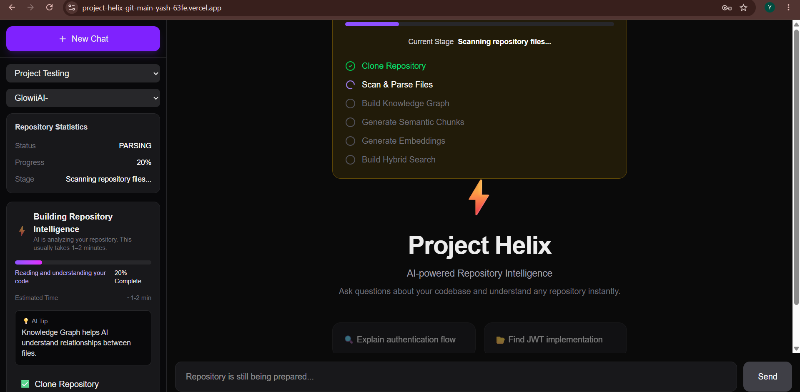
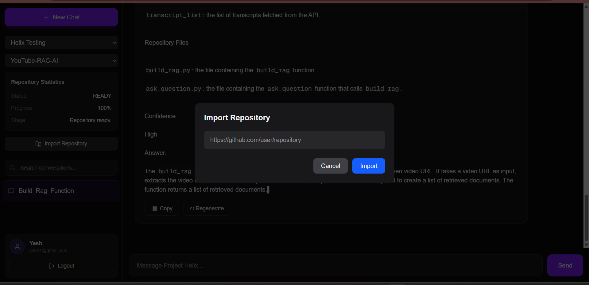
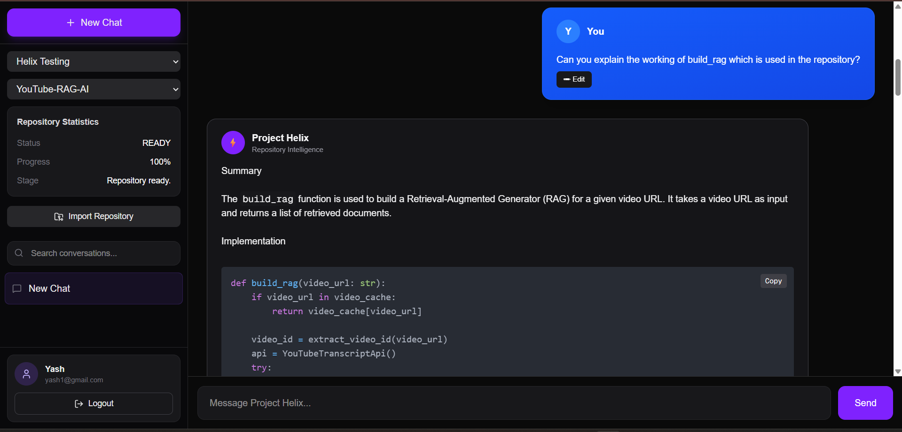

# ⚡ Project Helix

<p align="center">
  <strong>AI-Powered Repository Intelligence Platform</strong>
</p>

<p align="center">
  Understand, search, and chat with any GitHub repository using Retrieval-Augmented Generation (RAG), semantic code search, and conversational AI.
</p>

<p align="center">


</p>

---

# Overview

Project Helix transforms GitHub repositories into an AI-searchable knowledge base.

Instead of manually exploring hundreds of files, developers can simply ask questions in natural language and receive context-aware answers backed by the actual source code.

The platform automatically clones repositories, parses the source code, builds semantic embeddings, indexes everything into a vector database, and enables intelligent conversations over the repository.

---

# Features

## Repository Intelligence

- Import public GitHub repositories
- Automatic repository cloning
- Recursive repository scanning
- Repository metadata indexing
- Multi-project repository management

---

## Code Intelligence

- Python AST Parsing
- Function & Class Extraction
- Import Dependency Analysis
- Semantic Code Chunking
- Repository Structure Understanding

---

## AI Intelligence

- Retrieval-Augmented Generation (RAG)
- Context-Aware Repository Chat
- Semantic Code Search
- Persistent AI Conversations
- Conversation Memory
- Query Rewriting
- Source-Grounded Responses

---

## Search Pipeline

- Sentence Transformer Embeddings
- PostgreSQL + pgvector
- Hybrid Retrieval (Vector + BM25)
- Cross-Encoder Re-ranking
- Context Ranking

---

## User Management

- JWT Authentication
- User Registration/Login
- Multiple Projects
- Multiple Repositories
- Persistent Chat History
- Rename/Delete Conversations

---

# System Architecture

```text
                     Next.js Frontend
                             │
                             ▼
                     FastAPI Backend
                             │
     ┌───────────────────────┼────────────────────────┐
     │                       │                        │
     ▼                       ▼                        ▼
 Authentication        Project APIs         Repository APIs
                                                  │
                                                  ▼
                                         Repository Scanner
                                                  │
                                                  ▼
                                              AST Parser
                                                  │
                                                  ▼
                                         Semantic Chunking
                                                  │
                                                  ▼
                                         Embedding Generator
                                                  │
                                                  ▼
                                       PostgreSQL + pgvector
                                                  │
                                                  ▼
                                         Hybrid Retrieval
                                           (Vector + BM25)
                                                  │
                                                  ▼
                                        Cross Encoder Reranker
                                                  │
                                                  ▼
                                    Conversation-aware RAG
                                                  │
                                                  ▼
                                             Groq AI
```

---

# Tech Stack

## Frontend

- Next.js
- React
- TypeScript
- Tailwind CSS
- React Markdown
- React Flow

---

## Backend

- FastAPI
- SQLAlchemy (Async)
- PostgreSQL
- Alembic
- Docker

---

## AI & Retrieval

- Groq
- Sentence Transformers
- pgvector
- BM25 Retrieval
- Cross Encoder Re-ranking
- Retrieval-Augmented Generation (RAG)

---

## Repository Processing

- GitPython
- Python AST
- Semantic Chunking

---

# Project Structure

```text
apps/
├── api/
│
├── app/
├── authentication/
├── repositories/
├── parser/
├── retrieval/
├── ai/
├── chat/
├── embeddings/
├── graph/
├── source_viewer/
├── context/
└── ...
│
└── web/
    ├── app/
    ├── components/
    ├── hooks/
    ├── providers/
    ├── services/
    ├── types/
    └── ...
```

---

# Screenshots

## Dashboard



---

## Repository Import



---

## AI Chat



---

## Mobile Responsive UI


---

# Live Demo

### Frontend

```
https://project-helix-git-main-yash-63fe.vercel.app
```

### Backend API

```
https://project-helix-production-7047.up.railway.app
```

---

# Getting Started

## Clone Repository

```bash
git clone https://github.com/yashch3101/Project-Helix.git

cd project-helix
```

---

## Backend Setup

```bash
cd apps/api

python -m venv .venv

source .venv/bin/activate

pip install -r requirements.txt

uvicorn app.main:app --reload
```

---

## Frontend Setup

```bash
cd apps/web

npm install

npm run dev
```

---

# Environment Variables

## Backend

```env
DATABASE_URL=

JWT_SECRET_KEY=

GOOGLE_API_KEY=

GITHUB_TOKEN=
```

---

## Frontend

```env
NEXT_PUBLIC_API_URL=
```

---

# Current Capabilities

- AI Repository Chat
- Repository Import
- Semantic Code Search
- AST-based Repository Understanding
- Multi-project Management
- Hybrid Retrieval
- Conversation Memory
- Query Rewriting
- Cross Encoder Re-ranking
- Persistent Chat Sessions
- Repository Statistics
- Responsive UI
- Source-grounded AI Responses

---

# Roadmap

## Completed

- JWT Authentication
- Project Management
- Repository Import
- Repository Scanner
- AST Parser
- Semantic Chunking
- Embedding Pipeline
- Hybrid Search
- Cross Encoder Re-ranking
- AI Chat
- Conversation Memory
- Query Rewriting
- Repository Statistics
- Responsive Dashboard
- Mobile Responsive UI

---

## Upcoming Features

- Interactive Dependency Graph
- Repository Knowledge Graph
- Framework Detection
- Multi-Agent Reasoning
- AI Code Review
- AI Code Generation
- Automatic Documentation Generation
- Repository Visualization
- Pull Request Analysis
- Repository Health Dashboard

---

# Why Project Helix?

Modern repositories contain thousands of files, making onboarding and architecture exploration difficult.

Project Helix bridges this gap by allowing developers to interact with repositories through natural language while providing answers grounded in the actual source code.

It combines software engineering techniques with modern AI retrieval systems to significantly reduce repository exploration time.

---

# Vision

Project Helix aims to become an autonomous AI Software Engineering Platform capable of understanding complex repositories, reasoning across large-scale codebases, assisting developers in debugging, architecture exploration, documentation generation, and software design through conversational AI.

---

# Contributing

Contributions are welcome!

If you'd like to improve Project Helix:

1. Fork the repository
2. Create a new feature branch

```bash
git checkout -b feature/my-feature
```

3. Commit your changes

```bash
git commit -m "Add new feature"
```

4. Push your branch

```bash
git push origin feature/my-feature
```

5. Open a Pull Request

---

# License

This project is licensed under the MIT License.

See the **LICENSE** file for more details.

---

# Author

## Yash Chaurasia

AI/ML Engineer • Full Stack Developer • Backend Developer

- GitHub: https://github.com/yashch3101
- LinkedIn: https://www.linkedin.com/in/yashchaurasia2910

---

<p align="center">

⭐ If you found this project useful, consider giving it a star.

Built with ❤️ using FastAPI, Next.js, PostgreSQL, RAG and Generative AI.

</p>